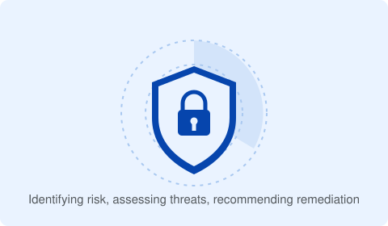

# Cyber Security — Security Procedures and Controls

*Digital Support and Security T Level → Occupational Specialisms → Cyber Security → Security Procedures and Controls*

This is Content Area 1 of the Cyber Security occupational specialism. Every specialism has a version of this content area, but here — since security is the specialism's whole focus — it goes noticeably deeper, into governance, IT service management frameworks, cryptography, digital certificates and the legal/ethical framework a cyber security technician operates within.

<figure>

<figcaption>Cyber Security: identifying risk, assessing threats, recommending remediation.</figcaption>
</figure>

## 1.1 Purpose of organisational information security governance

Governance exists to investigate, control, communicate and report cyber risk; to give the organisation a security framework (defined roles such as data controller/processor, policies like retention and deletion, and defined security activities such as evaluating new systems); to manage compliance against legislation/frameworks/standards (e.g. ISO 27001, data protection law, FOI requests); and to align organisational priorities with mitigating cyber threats (e.g. setting password-complexity rules).

## 1.2 IT governance principles

Six principles: **responsibility** (everyone understands their information-security role, e.g. asset owner, data controller/processor); **strategy** (secure-by-design, accounting for future infrastructure needs like cloud services); **acquisition** (every purchase evaluated for risk, benefit and cost, with transparent decisions); **performance** (enough preventative and remedial capability to guarantee CIA); **conformance** (IT/data/information use complies with mandatory legislation and regulation); **human behaviour** (technical and non-technical controls both factored into policy and decisions).

## 1.3 Cyber security protection methods by layer

- **Hardware** — hardware protection (server/software solutions protecting hardware/data), device hardening, physical controls (secure storage, locked cages, CCTV, key-card doors).
- **Operating systems** — patch/update installation (with rollback via system snapshot if a patch causes problems), OS hardening (removing unneeded accounts/functions/apps/ports).
- **Networks** — segmentation/isolation (limiting lateral movement), network monitoring, network hardening (securing inter-device channels), firewalls.
- **Software** — anti-malware/anti-virus, SSO, MFA, RMM, vulnerability management/scanning, application hardening, access controls, strong-password credential policy, Privileged Access Management (PAM), application firewalls, patching.
- **Cloud** — auditing/monitoring (log review for unusual behaviour), access controls, MFA (extended here to include a "somewhere you are" factor, e.g. IP-based location).

## 1.4 Cyber security principles in network infrastructure design

Design is framed around five aims:

- **Establish the context** — adopt zero-trust early, define purpose/requirements/acceptable risk, identify vulnerabilities, consider end-user behaviour, define supplier security responsibilities, map infrastructure end-to-end (including where sensitive data lives), and clarify governance/roles.
- **Make compromise difficult** — obscure/anonymise data, reduce the attack surface, maintain and test controls, protect management/operational environments, apply proven industry-standard solutions, audit all operations, and design for efficient maintenance.
- **Make disruption difficult** — build resilience to attack and failure, design for scalability against sudden demand, spot exploitable bottlenecks, plan for third-party failure, run mock incident-response exercises, and use external penetration testing to make attackers' jobs harder.
- **Make compromise detection easier** — gather and analyse security event data/logs, keep alerting current for known malware, separate monitoring systems from operational ones so logging survives an incident, and monitor continuously to understand what "normal" looks like.
- **Reduce the impact of compromise** — use network segmentation to limit malware/threat-actor movement, remove unneeded functionality/caches, avoid management bypasses, keep recovery straightforward and tested, enforce separation of duties, and anonymise data to limit personal-information loss.

## 1.5 Operating systems and key components for investigation

**OS/device types**: client-side (Windows/macOS/Linux — desktops/laptops), mobile (Android/iOS — tablets/phones), server-side (Windows/Linux network OS). **OS functions**: security (e.g. zero trust), system performance, error detection, GUI, memory management, processor management (e.g. protecting against side-channel attacks), device management (e.g. requiring signed drivers), file management, program execution control, and input/output handling. **Components useful in an investigation**: configuration files (Linux), the registry (Windows), logs (network/traffic monitoring), library/preference files (macOS), the file system (NTFS, FAT32, exFAT, APFS, ext4 — varies by OS), and running processes.

## 1.6 Physical and virtual server types

**Physical servers** run applications directly on hardware with full hardware access. **Virtualisation** offers **virtual servers** (one machine running multiple isolated OS/software instances) and **containers** (isolated, portable application packages carrying only what they need to run, adding security and portability).

## 1.7 IT service management (ITSM)

Purpose: manage the end-to-end delivery of IT services to customers. Core processes: **service request management** (handling and tracking queries/incidents, e.g. reporting a potential cyber incident to the service desk); **knowledge management** (keeping documentation current, e.g. standardised hardened builds); **IT asset management** (tracking hardware/software/config via a CMDB); **problem and incident management** (root-cause analysis and coordinated response, e.g. standard cyber-incident procedures); **change management** (changes agreed by stakeholders and recorded, e.g. adding a new firewall rule).

## 1.8 The ITIL® service lifecycle

**Service strategy** (align to business objectives), **service design** (design services and supporting elements for people, process, product, partners), **service transition** (build/deploy with coordinated change management), **service operation** (fulfil requests, resolve failures, run routine operations), **continual service improvement** (ongoing efficiency/effectiveness gains).

## 1.9 Cyber security principles for transmitting digital information

Identify the data's security requirements using the **CIA triad**. Prevent eavesdropping in transit using **asymmetric encryption**. Authenticate/verify data using cryptographic properties — integrity, authenticity, confidentiality, non-repudiation.

## 1.10 Frameworks and standards supporting an ISMS

An Information Security Management System (ISMS) creates policies (information security policy, acceptable use policy) to keep an organisation compliant. **Frameworks**: COBIT (governance/management of IT systems), SOC 2 (assesses security/availability/processing integrity/confidentiality/privacy controls), NIST (helps organisations manage cyber risk). **Standards**: ISO 27000 series, especially ISO 27001 (establish/implement/maintain/improve an ISMS); ISO 38500:2015 (IT governance framework — note: sometimes referenced as ISO 35800 in source material, the correct standard number is ISO/IEC 38500); NCSC Cyber Essentials / Cyber Essentials Plus (government-backed accreditation scheme); PCI DSS (reduces payment-card fraud through security controls).

## 1.11 Purpose and importance of a disaster recovery plan (DRP)

Purpose: a formal document detailing how to respond to unplanned incidents — natural disasters, power outages, cyber-attacks and other disruption. Importance: minimises MTTR, minimises interruption to normal operations, limits the extent of disruption/damage, minimises economic impact, sets up alternative means of operation in advance, enables prompt service restoration, and helps identify gaps (e.g. lack of staff training).

## 1.12 Implementing a DRP

Define the incident's scope (environmental/technical, organisational, departmental, individual impact) → gather relevant information (historic outages, hardware/software/network/data inventories, contact details) → risk-assess (likelihood and impact on business-as-usual) → create the plan (identify required resources — systems, staff roles, budget) → get plan approval (sign-off) → test the plan (scope, frequency, execution, review, amendment) → continuous improvement (internal/external auditing, gap analysis against current controls, assessing control effectiveness, and recording/communicating improvement areas). *(M10, D3.)*

## 1.13 Preventative controls

Purpose: stop unauthorised access/tampering or mitigate environmental incidents. Physical: specialist locks, barriers, flood/fire defence systems. Managed entry: manned reception, security guards, restricted door control, card readers. Biometric: facial recognition, fingerprints. Video/CCTV. PIN/passcodes. Technical: firewalls, allow/deny lists, sandboxing, device hardening (default password changes, correct permissions, updates, removing unneeded software, security policy, disabling unauthorised devices like USB drives). Procedural: separation of duties, RBAC.

## 1.14 Corrective controls

Purpose: limit the extent of damage and stop recurrence. Physical: fire suppression (sprinklers, extinguishers), gas suppression (inert/chemical). Technical: patching, disconnecting infected systems, quarantining a virus. Procedural: SOPs (e.g. fire response actions), DRP invocation.

## 1.15 Compensating controls

Purpose: a safeguard against a primary control failing. Physical: segregation of duties, log management/auditing (e.g. key-code access logs). Technical: encryption. Procedural: mandatory cyber-awareness training, regular control testing (e.g. simulated attacks), SOPs (e.g. environmental monitoring).

## 1.16 Protecting personal, physical and environmental security

Review the potential risk (gather information from systems/users, e.g. logs, security events) → select and apply appropriate preventative/corrective/compensating controls → comply with relevant regulation and organisational policy (e.g. Data Protection Act 2018).

## 1.17 Purpose and characteristics of cryptography

Purpose: secure and authenticated data transmission via encryption or hashing. Characteristics: **encryption** (reversible, public/private key based), **confidentiality** (only intended recipients can decrypt — symmetric or asymmetric), **authenticity** (recipient verifies the sender via a digital signature, using asymmetric encryption), **hashing** (non-reversible, fixed-length output, e.g. password hashing), **integrity** (data cannot be modified in transit — via HMAC). **Non-repudiation** guarantees authorship of a message via a message authentication code (MAC).

## 1.18 Digital certificates

Purpose: an electronic "signature" proving the authenticity of a device, server or user via asymmetric cryptography. Features: certificate holder name, unique serial number, expiration date, the holder's public key, and the issuer's signature. Types: server-side (client verifies a server), client-side (client authenticates to a server), code signing (OS verifies software's author/integrity).

## 1.19 Certificate management tools

Monitor expiry dates, revoke certificates early if needed, auto-renew expired certificates, and create/sign/issue new certificates — including auditing that a certificate is correctly deployed/removed and diagnosing certificate-related issues.

## 1.20 Generating a digital certificate

Generate a public/private key pair → generate a Certificate Signing Request (CSR) → have it issued and signed by a trusted Certificate Authority (CA) → install the certificate on the client/server device.

## 1.21 Legislation relevant to cyber security

- **Data Protection Act 2018** — obliges organisations to protect personal data against cyber-attacks, detect security events, and minimise incident impact.
- **Investigatory Powers Act 2016** — collates and authorises law-enforcement/security-agency powers to obtain communications data.
- **Human Rights Act 1998** — protects human rights against exploitation; binds all public authorities.
- **Telecommunications (Security) Act 2021** — duties on network/service providers to prevent, mitigate/remedy, and disclose security compromises.
- **Computer Misuse Act 1990** — criminalises unauthorised computer access, access with intent to commit further offences, and unauthorised modification/deletion of data (plus supplying tools for such offences).
- **Freedom of Information Act 2000** — exempts certain security bodies (e.g. NCSC) from disclosure obligations.
- **Network and Information Systems Regulations 2018 (UK)** — sets a common security baseline for network/information systems, covering Operators of Essential Services (OES) and Relevant Digital Service Providers (RDSPs).
- **Official Secrets Act 1989** — protects disclosure of security/intelligence information.
- **Wireless Telegraphy Act 2006** — regulates wireless transmitting devices in the UK and criminalises unauthorised interception of wireless communications.

## 1.22 Ethical codes of conduct

- **UK Cyber Security Council Code of Ethics** — credibility (accountable, ethical conduct), integrity (honesty, legal compliance), professionalism (share knowledge, promote public understanding, evidence-based practice, correct misinformation), responsibility and respect (take ownership, safeguard data, declare conflicts of interest, champion equality/diversity/inclusion).
- **BCS (British Computer Society) code of conduct** — make IT for everyone (professional information sharing); show what you know, learn what you don't (only work within your competence, keep developing, understand legislation, stay ethical); respect the organisation/individual you work for (due care, professional responsibility, no personal-gain disclosures, don't exploit others' inexperience); keep IT real/professional/pass it on (uphold the profession's reputation, raise standards, act with integrity, support colleagues).

## 1.23 Core cyber security terminology

**CIA triad** — confidentiality (access/modification restricted to authorised users), integrity (data can't be modified without authorisation), availability (authorised users can access data when needed). **IAAA** — identification (unique identity, e.g. username/employee number), authentication (verifying identity — single-factor or MFA), authorisation (granting permissions via access-control models), accountability (actions traceable to a specific user). Also: **access control methods** (e.g. MAC), **defence in depth** (layered security so one failure doesn't compromise the whole system), **reliability** (system performs as specified over time) and **assurance** (confirming security requirements have actually been met).

## 1.24 Managing and assessing security requests

Assess a request's validity by considering its origin, its reason, the requestor's status/permissions, its sensitivity (e.g. personal-data exposure), any new risk it would introduce, and whether it complies with regulatory requirements. *(D4.)*

## Key terms

- **Zero trust** — a design principle where no access is granted by default; every request is verified regardless of network location.
- **ISMS** — Information Security Management System, the policy framework (e.g. under ISO 27001) that governs how an organisation manages information security.
- **CA / CSR** — Certificate Authority and Certificate Signing Request, the mechanism behind issuing a digital certificate.
- **PAM** — Privileged Access Management, controlling and monitoring elevated-access accounts.
- **Defence in depth** — layering multiple independent security controls so a single failure doesn't expose the whole system.

## Related pages

- [Cyber Security: Remediation and Risk Assessment](02-remediation-and-risk-assessment.md)
- [Cyber Security: Sources of Knowledge](03-sources-of-knowledge.md)
- [Digital Support: Security Procedures and Controls](../digital-support/01-security-procedures-and-controls.md)
- [Occupational Specialisms overview](../00-overview.md)
- [Scheme of Assessment](../05-scheme-of-assessment.md)
